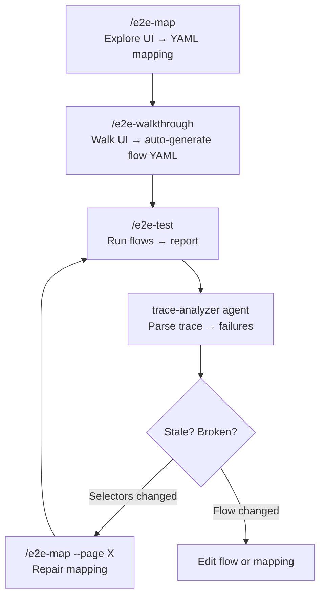

# e2e-pipeline

Browser E2E testing pipeline for Claude Code. Maps UI elements, runs test flows, and walks through apps interactively — all with context-isolating subagents that keep browser data out of your main conversation.

## Prerequisites

- [agent-browser](https://github.com/anthropics/agent-browser) CLI installed globally

## Quick Start

### 1. Map your app's UI

```
/e2e-map
```

Creates a YAML mapping of pages, elements, and selectors in `.claude/e2e/mappings/<app>.yaml`.

### 2. Run a test flow

```
/e2e-test <flow-name>
```

Executes a flow file from `.claude/e2e/flows/` against the mapped UI.

### 3. Walk through interactively

```
/e2e-walkthrough
```

Human-guided browser exploration with trace recording and auto-generated flow output.

## Commands

| Command | What it does |
|---------|-------------|
| `/e2e-map` | Create or update UI element mappings |
| `/e2e-test <flow>` | Run a specific E2E test flow |
| `/e2e-test --tag smoke` | Run all flows tagged with `smoke` |
| `/e2e-test --suite <name>` | Run a named test suite |
| `/e2e-walkthrough` | Interactive browser walkthrough |
| `/e2e-walkthrough --smoke` | Auto-generated smoke walkthrough from mapping |
| `/e2e-dispatch` | Unified entry point (routes to the right skill) |
| `/e2e-skill-ops` | Debug, maintain, or evaluate E2E skills |

---

## The Closed-Loop Pipeline

This plugin forms a self-healing cycle: **Map → Test → Analyze → Repair → Re-test**.



Every step feeds back into the next. A walkthrough auto-generates a reusable flow. A failing test tells you whether to update the mapping or the flow. No manual glue needed.

---

## Creating Semantic E2E Tests

Tests in this pipeline are written in natural language, not code. You describe *what* to do, not *how* to locate elements.

### Step 1: Map the UI

```
/e2e-map
```

The mapper agent opens your app, explores every page, and produces a mapping YAML with semantic element names:

```yaml
# .claude/e2e/mappings/my-app.yaml
pages:
  login:
    url_pattern: "/login"
    elements:
      email_input: { selector: "[data-testid='email']" }
      password_input: { selector: "[data-testid='password']" }
      submit_button: { selector: "button[role='button'][name='Sign In']" }
  dashboard:
    url_pattern: "/dashboard"
    elements:
      welcome_text: { selector: "[data-testid='welcome']" }
```

### Step 2: Write a flow in natural language

Flow files use plain English for actions and expectations:

```yaml
# .claude/e2e/flows/login-flow.yaml
name: Login Flow
mapping: my-app
tags: [smoke]
steps:
  - id: navigate-to-login
    action: Navigate to /login
    expect: email_input visible on login

  - id: fill-credentials
    action: Fill email_input with 'test@example.com' on login
    expect: email_input visible on login

  - id: enter-password
    action: Fill password_input with 'password123' on login

  - id: submit-form
    action: Click submit_button on login
    expect: url contains /dashboard

  - id: verify-dashboard
    action: Verify welcome_text on dashboard
    expect: welcome_text visible on dashboard
```

No CSS selectors, no XPath, no Page Object boilerplate. Just element names from your mapping + human-readable actions.

### Step 3: Or, let the walkthrough generate flows for you

If you don't want to write YAML by hand:

```
/e2e-walkthrough
```

Walk through the app interactively. When done, the skill **automatically generates** a flow YAML capturing every step you performed — ready to replay with `/e2e-test`.

### Step 4: Run it

```
/e2e-test login-flow
```

The test runner resolves element names to selectors via the mapping, executes each step, validates expectations, and returns a pass/fail report.

---

## When the UI Changes

### Scenario A: UI updated, flow unchanged

The visual design changed (new layout, restyled buttons) but the user journey is the same. Only selectors need updating.

```
/e2e-map --page login
```

This re-explores just the `login` page, updates selectors in the mapping, and preserves all other pages. Your existing flow files remain untouched — they reference element *names*, not selectors.

Then re-run:

```
/e2e-test login-flow
```

If a few elements moved but the overall mapping is intact, a scoped walkthrough also works:

```
/e2e-walkthrough --page login
```

This walks the specific page, detects stale selectors, and offers to patch the mapping automatically.

### Scenario B: UI flow entirely redesigned

The user journey itself changed — new pages, different steps, removed features. The old flow YAML no longer matches reality.

1. **Re-map the affected pages** (or the whole app):

   ```
   /e2e-map
   ```

2. **Walk through the new flow** to auto-generate a replacement:

   ```
   /e2e-walkthrough
   ```

   Describe what changed. The skill proposes a walkthrough plan based on the updated mapping. After walking, it generates a new flow YAML.

3. **Delete or archive the old flow**, rename the new one:

   ```bash
   mv .claude/e2e/flows/walkthrough-20260309-login.yaml .claude/e2e/flows/login-flow.yaml
   ```

4. **Verify**:

   ```
   /e2e-test login-flow
   ```

---

## PR Review with E2E Evidence

### Proving a bug fix works

A PR claims to fix a frontend bug. Use the pipeline to produce evidence:

```
/e2e-walkthrough --pr 940
```

The skill reads the PR diff, identifies which UI pages are affected, and proposes a walkthrough targeting the fix. Walk through the repaired flow — the output includes:

- Step-by-step screenshots
- Console error / API failure counts (via trace analysis)
- Auto-generated flow YAML capturing the working state

Then post the results as a PR comment:

```
/e2e-test <generated-flow> --pr 940
```

The test summary (pass/fail, step count, health data) is posted directly to the PR as a comment, giving reviewers concrete proof.

### Proving a feature matches requirements

A PR implements a feature from a spec or flowchart. You need to verify the implementation matches the expected flow:

```
/e2e-walkthrough --pr 940 --issue DRC-2779
```

The skill reads both the PR diff and the issue description (from Linear/GitHub), then proposes a walkthrough plan covering the feature's expected flow. Walk through it step by step:

1. The walkthrough plan maps issue requirements → UI pages → expected elements
2. Each step verifies elements exist, interactions work, and navigation is correct
3. Trace analysis catches API errors or console warnings hidden from the UI
4. A flow YAML is auto-generated, becoming a **regression test** for this feature

Post results:

```
/e2e-test <generated-flow> --pr 940 --issue DRC-2779
```

The PR comment includes the issue context, making the review self-documenting.

---

## Debugging with E2E

A user reports "something is broken." The approach depends on the failure type.

### Static issues (always reproducible)

The problem is visible every time — a broken button, wrong text, missing element.

```
/e2e-walkthrough
```

Describe the reported issue. The skill plans a walkthrough targeting the affected area. As you step through:

- **Snapshots** show the accessibility tree — missing elements or wrong roles are immediately visible
- **Screenshots** capture the visual state
- **Console/error buffers** catch JS exceptions
- **Trace analysis** flags failed API calls

The walkthrough generates a flow that captures the broken state. After fixing, re-run the flow to confirm the fix:

```
/e2e-test <flow-name>
```

### Dynamic issues (specific conditions required)

The bug only appears under certain conditions — specific data, user role, or navigation sequence.

1. **Set up the condition** by writing a flow with the specific preconditions:

   ```yaml
   steps:
     - id: setup-condition
       action: Navigate to /settings
     - id: change-role
       action: Click role_selector on settings
     - id: select-admin
       action: Click admin_option on settings
     - id: navigate-to-bug
       action: Navigate to /dashboard
     - id: verify-bug
       action: Verify broken_element on dashboard
       expect: broken_element visible on dashboard
   ```

2. Or use a guided walkthrough to reproduce the exact sequence:

   ```
   /e2e-walkthrough
   ```

   Describe the conditions: "Navigate to settings, switch role to admin, then go to dashboard — the chart should show but it's blank." The skill plans the sequence and you walk through it.

3. The trace captures the full network + console history leading up to the failure, making root cause visible.

### Intermittent issues (requires multiple attempts)

The bug appears randomly — race conditions, timing issues, flaky state.

1. **Create the flow** for the problematic sequence (write manually or via walkthrough)

2. **Run it multiple times** to catch the failure:

   ```
   /e2e-test flaky-flow
   ```

   Repeat across runs. Each run produces a separate report in `e2e-reports/<timestamp>/` with its own trace.

3. **Compare traces** across passing and failing runs. The trace analyzer extracts API failures and console errors — diff these to isolate what's different in failing runs.

4. **Use `/e2e-skill-ops --evaluate`** after collecting several runs to classify failures by pattern:

   ```
   /e2e-skill-ops --evaluate
   ```

   This aggregates results, distinguishes recurring vs one-off failures, and identifies skill/mapping gaps.

5. Once the root cause is found and fixed, keep the flow as a **regression test** tagged for smoke:

   ```yaml
   tags: [smoke, regression, flaky-fix]
   ```

---

## Recording & Evidence Capabilities

### What the pipeline captures

| Artifact | Format | When |
|----------|--------|------|
| Accessibility snapshots | Text (a11y tree) | Every step |
| Screenshots | PNG | On failure + optionally per step |
| Annotated screenshots | PNG with labeled elements | On demand (`--annotate`) |
| Network trace | JSONL HAR (trace.zip) | Per walkthrough/test run |
| Console log | JSONL (trace.zip) | Per walkthrough/test run |
| Trace analysis report | Markdown | After each trace |
| Test report | Markdown | After each test run |
| Flow YAML | YAML | Auto-generated after walkthrough |

### Video recording

The pipeline does **not** currently produce video files (MP4/WebM). What it does produce:

- **Trace files** (`trace.zip`) that can be viewed as an interactive replay: `npx playwright show-trace trace.zip`
- **Per-step screenshots** that document the visual state at each action
- **Full network + console capture** for post-mortem analysis

Playwright's trace viewer provides a frame-by-frame replay with network waterfall, console log, and DOM snapshots — often more useful than video for debugging.

---

## File Structure

```
.claude/e2e/
├── mappings/          # UI element mappings (YAML)
│   ├── my-app.yaml
│   └── my-admin.yaml
├── flows/             # Test flow definitions (YAML)
│   └── login-flow.yaml
└── suites/            # Test suite definitions (YAML)
    └── smoke.yaml
```

## Architecture

Skills run in main context as thin orchestrators. Heavy browser work is delegated to subagents:

| Skill | Agent | Role |
|-------|-------|------|
| `e2e-map` | `e2e-mapper` | Explore pages, extract selectors |
| `e2e-test` | `e2e-test-runner` | Execute flow steps, collect results |
| `e2e-walkthrough` | `e2e-trace-analyzer` | Parse trace.zip for API/console errors |

This keeps browser screenshots, accessibility trees, and trace data out of the main conversation context.

## Multi-Site Testing

Map multiple apps, then test across them:

```
/e2e-map                              # map each app separately
/e2e-test --all-sites                  # run flows on all mapped sites
/e2e-walkthrough --sites admin,portal  # cross-site walkthrough
```

## Troubleshooting

| Issue | Fix |
|-------|-----|
| `agent-browser not found` | Install globally: see [agent-browser](https://github.com/anthropics/agent-browser) |
| Auth expired during test | Delete `~/.agent-browser/<app>/` and re-login |
| Selectors stale | Re-run `/e2e-map --page <page>` to refresh |
| Flow uses v1 format | Migrate: `app:` → `mapping:`, step `name:` → `id:`, structured expects → grammar strings |
| Test keeps failing on one step | Run `/e2e-skill-ops --debug` to diagnose |

For deeper diagnostics: `/e2e-skill-ops --debug`

## License

[MIT](LICENSE)
