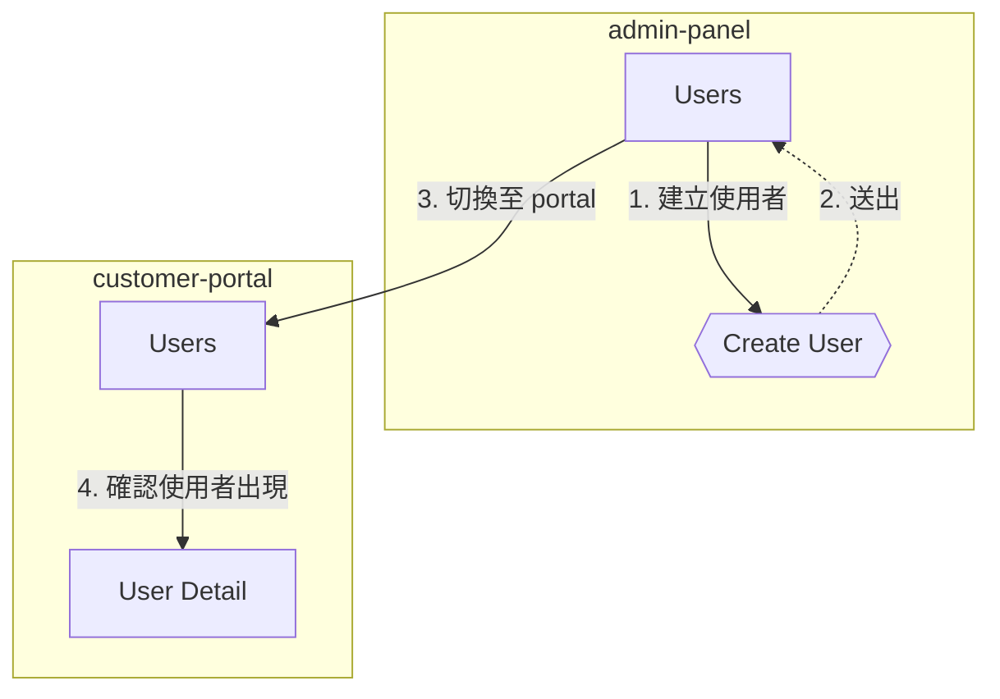

# Flow Report Design — Walkthrough 流程探索報告

**日期**: 2026-03-10
**狀態**: Approved

## 目標

e2e-walkthrough 完成後自動產生一份「流程探索報告」(`flow-report.md`)，用 mermaid 流程圖 + 自然語言描述呈現探索路徑，讓開發者和團隊成員能直觀理解並調整步驟。

## 受眾

以開發者為主，兼顧團隊成員/PM 閱讀。

## 輸出格式

兩段式：獨立 `flow-report.md` + `report.md` 頂部摘要連結。

---

## 1. `flow-report.md` 結構

```markdown
# Flow Report — <walkthrough context summary>

**日期**: YYYY-MM-DD HH:MM
**Mapping**: <mapping name>
**模式**: guided|step|auto
**結果**: 探索 N 個頁面、N 個對話框、N 個步驟 | N anomalies

---

## 流程總覽

> 使用者從 {起始頁} 出發，{主要路徑摘要}。{結論}。

## 流程圖

\`\`\`mermaid
flowchart TD
    ...
\`\`\`

## 逐步敘述

### Step 1 — {來源頁} → {目標頁/元件}
{動作描述}
**結果**: ✅ PASS | ⚠️ CONDITIONAL | ❌ FAIL

...

## 建議調整
<!-- 無異常時省略整區 -->
```

## 2. Phase 4 整合位置

插入在 step 4 (report.md) 之後、step 5 (GIF generation) 之前：

```
1.  Stop recording
2.  Stop trace
3.  Trace analysis (subagent)
4.  Report (report.md)
4.5 Flow Report (flow-report.md)   ← NEW
5.  GIF generation
6.  Flow YAML auto-generation
7.  Cross-site flow
8.  PR/Issue posting
9.  Mapping self-repair
10. Browser handoff + post-completion menu
```

- **Mandatory**：與 Flow YAML 一樣自動產生，不需使用者選擇
- **report.md 頂部**：新增摘要區 + 連結至 flow-report.md

### report.md 摘要區

```markdown
## Flow Report

> 探索 N 頁面 / N 對話框 / N 步驟 — N anomalies
> 詳見 [flow-report.md](./flow-report.md)

---
```

### Post-Completion Menu 變更

新增選項 2「發佈 flow report 到 PR」：

```
接下來要做什麼？

1. 發佈到 PR（gh pr comment <PR>）
2. 發佈 flow report 到 PR                    ← NEW
3. 產生可重複使用的 flow YAML → /e2e-test 可 replay
4. 產出 GIF（步驟截圖動畫）
5. 產出 WebM 錄影（完整 viewport）
6. 產出 GIF + WebM（兩者都要）
7. 結束（browser 保持開啟）
```

- 選項 2 條件：`--pr` 或使用者提過 PR 時才顯示
- 執行：`gh pr comment N --body "$(cat $REPORT_DIR/flow-report.md)"`

## 3. Mermaid 流程圖生成規則

### 節點類型

| UI 概念 | Mermaid 語法 | 範例 |
|---------|-------------|------|
| 頁面 | 方框 `["..."]` | `A["Dashboard"]` |
| 對話框/Modal | 雙括號 `{{"..."}}` | `C{{"新增成員 Dialog"}}` |
| 表單送出 | 體育場形 `(["..."])` | `F(["送出表單"])` |
| 條件分支 | 菱形 `{"..."}` | `D{"選擇角色"}` |

### 邊（Edge）規則

- Label 格式：`"N. 動作摘要"`（N = 步驟編號）
- 動作摘要 ≤ 15 字，超過截斷
- 返回同一頁面：虛線箭頭 `-.->` 區分「前進」與「回到原處」
- 同頁面多次出現不重複建立節點

### 節點 ID 規則

頁面名 camelCase 簡寫，對話框加 `Dlg` 後綴。避免 mermaid 保留字衝突。

### Cross-Site Walkthrough

每個 site 用 `subgraph` 包裹，跨 site 的邊標註切換動作：



## 4. 自然語言生成規則

### 總覽摘要

- 2-3 句話，描述整體路徑和結論
- 模板：「使用者從 `{起始頁}` 出發，{主要路徑摘要}。{結論}。」
- 結論自動選擇：
  - 0 anomalies →「整體流程順暢，未發現異常。」
  - 有 anomalies →「發現 N 處異常，詳見建議調整區。」
  - 有 health issues →「發現 N 個 console error / API failure，詳見 trace analysis。」

### 逐步敘述

- 標題：`### Step N — {來源頁} → {目標頁/元件}`
- 內文：一段話描述動作、位置、結果
- 結果標記：`✅ PASS`、`⚠️ CONDITIONAL`（RBAC）、`❌ FAIL`
- FAIL 附一句原因摘要，不貼截圖路徑

### 建議調整區

| 來源 | 建議內容 |
|------|---------|
| Stale selector | 「Step N 的 `{element}` selector 可能過期，建議 `/e2e-map --page {page}`」 |
| Missing element | 「Step N 預期的 `{element}` 未出現在 `{page}`，確認是否已移除或搬遷」 |
| Trigger mismatch | 「Step N 的 `{element}` 互動行為與 mapping 不一致」 |
| Console error | 「Step N 後出現 console error：`{message 前 80 字}`」 |
| API failure | 「Step N 觸發 API 失敗：`{method} {path}` → `{status}`」 |
| 無異常 | 省略整個建議調整區 |

## 5. 預估大小

10 步驟 walkthrough 約 80-120 行 markdown，不造成 context 壓力。
