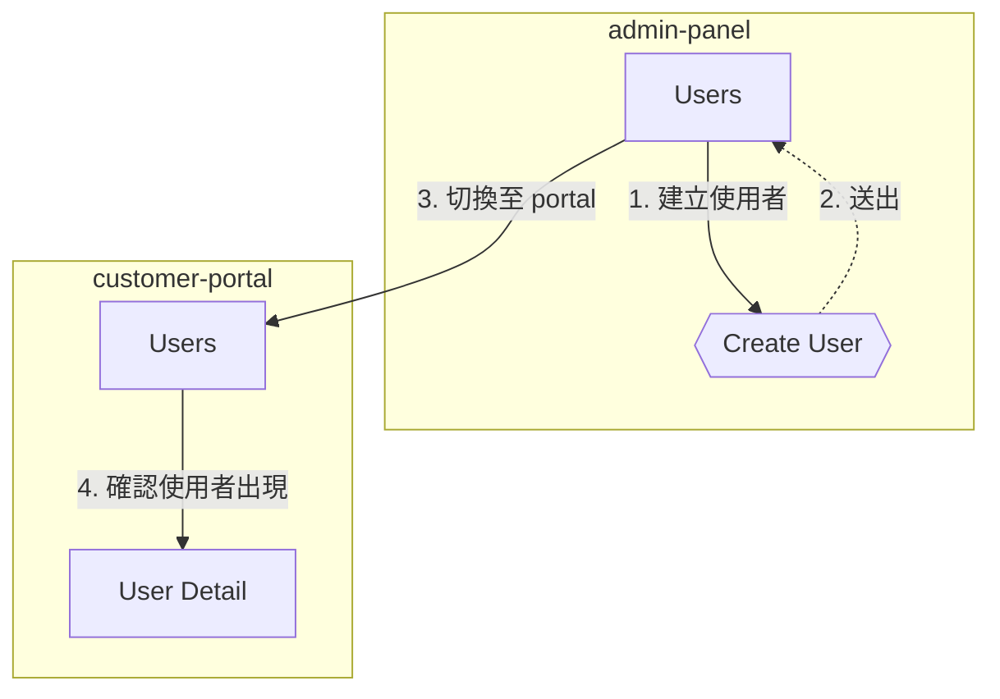

# Flow Report Implementation Plan

> **For Claude:** REQUIRED SUB-SKILL: Use superpowers:executing-plans to implement this plan task-by-task.

**Goal:** Add mandatory flow-report.md generation to e2e-walkthrough Phase 4, with mermaid flowchart + natural language step descriptions.

**Architecture:** Three files to modify — SKILL.md (Phase 4 numbered list + post-completion menu), reference.md (new "Flow Report" section with generation rules), and the design doc is already committed.

**Tech Stack:** Markdown skill definitions (no code — pure documentation changes)

---

### Task 1: Add Flow Report step to SKILL.md Phase 4 list

**Files:**
- Modify: `skills/e2e-walkthrough/SKILL.md:178-187` (Phase 4 numbered list)

**Step 1: Insert step 5 and renumber**

Change the Phase 4 numbered list from:

```
1. **Stop recording** (if recording): `agent-browser record stop`
2. **Stop trace**: `agent-browser trace stop "$REPORT_DIR/trace.zip"`
3. **Trace analysis**: Dispatch `e2e-trace-analyzer` subagent with `trace_path` + `report_dir`
4. **Report**: Write `$REPORT_DIR/report.md` with summary, step results, health log, media links
5. **GIF generation** (if recording): see `references/commands.md` § GIF Generation for the canonical ffmpeg command. Warn but continue if ffmpeg fails.
6. **Flow YAML auto-generation (MANDATORY)**: Always auto-generate — never ask. Auto-name: `walkthrough-<timestamp>-<first-page>.yaml`. Write to `.claude/e2e/flows/`
7. **Cross-site flow**: Use `sites:` instead of `mapping:` when `--sites` was used
8. **PR/Issue posting**: `--pr` → `gh pr comment`, `--issue` → Linear MCP
9. **Mapping self-repair**: Present discrepancy list, human approves, patch mapping. 3+ stale on same page → recommend `/e2e-map --page`
10. **Browser handoff (BLOCKING: flow YAML must be written first)**: Present summary table, then numbered action menu. Do NOT close browser — user may need to inspect final state.
```

To:

```
1. **Stop recording** (if recording): `agent-browser record stop`
2. **Stop trace**: `agent-browser trace stop "$REPORT_DIR/trace.zip"`
3. **Trace analysis**: Dispatch `e2e-trace-analyzer` subagent with `trace_path` + `report_dir`
4. **Report**: Write `$REPORT_DIR/report.md` with summary, step results, health log, media links. Include Flow Report summary at top (see step 5).
5. **Flow Report (MANDATORY)**: Write `$REPORT_DIR/flow-report.md` with mermaid flowchart + natural language step descriptions. See [reference.md](./reference.md) § Flow Report for generation rules.
6. **GIF generation** (if recording): see `references/commands.md` § GIF Generation for the canonical ffmpeg command. Warn but continue if ffmpeg fails.
7. **Flow YAML auto-generation (MANDATORY)**: Always auto-generate — never ask. Auto-name: `walkthrough-<timestamp>-<first-page>.yaml`. Write to `.claude/e2e/flows/`
8. **Cross-site flow**: Use `sites:` instead of `mapping:` when `--sites` was used
9. **PR/Issue posting**: `--pr` → `gh pr comment`, `--issue` → Linear MCP
10. **Mapping self-repair**: Present discrepancy list, human approves, patch mapping. 3+ stale on same page → recommend `/e2e-map --page`
11. **Browser handoff (BLOCKING: flow YAML + flow report must be written first)**: Present summary table, then numbered action menu. Do NOT close browser — user may need to inspect final state.
```

Key changes: step 4 gets note about Flow Report summary, new step 5 inserted, all subsequent steps renumbered, step 11 blocking condition updated.

**Step 2: Verify line count didn't break other references**

Scan SKILL.md for any hardcoded step number references (e.g., "step 3" in prose). Update if found.

**Step 3: Commit**

```bash
git add skills/e2e-walkthrough/SKILL.md
git commit -m "feat(walkthrough): add flow report as Phase 4 step 5"
```

---

### Task 2: Update post-completion menu in SKILL.md

**Files:**
- Modify: `skills/e2e-walkthrough/SKILL.md:189-206` (post-completion menu)

**Step 1: Add new option 2 and renumber**

Change the menu from:

```
接下來要做什麼？

1. 發佈到 PR（gh pr comment <PR>）
2. 產生可重複使用的 flow YAML → /e2e-test 可 replay
3. 產出 GIF（步驟截圖動畫）
4. 產出 WebM 錄影（完整 viewport）
5. 產出 GIF + WebM（兩者都要）
6. 結束（browser 保持開啟）
```

To:

```
接下來要做什麼？

1. 發佈到 PR（gh pr comment <PR>）
2. 發佈 flow report 到 PR
3. 產生可重複使用的 flow YAML → /e2e-test 可 replay
4. 產出 GIF（步驟截圖動畫）
5. 產出 WebM 錄影（完整 viewport）
6. 產出 GIF + WebM（兩者都要）
7. 結束（browser 保持開啟）
```

**Step 2: Update visibility rules**

Change the rules from:

```
- Options 3-5 only shown when recording was active
- Option 1 only shown when `--pr` was provided or user mentioned a PR
- Option 2 is always shown (flow YAML auto-generated, but user may want to rename/edit)
```

To:

```
- Options 4-6 only shown when recording was active
- Options 1-2 only shown when `--pr` was provided or user mentioned a PR
- Option 3 is always shown (flow YAML auto-generated, but user may want to rename/edit)
```

**Step 3: Commit**

```bash
git add skills/e2e-walkthrough/SKILL.md
git commit -m "feat(walkthrough): add flow report publish option to post-completion menu"
```

---

### Task 3: Add Flow Report section to reference.md

**Files:**
- Modify: `skills/e2e-walkthrough/reference.md` (insert after "### Report" section, before "### Flow YAML Auto-Generation")

**Step 1: Insert new section after line 152**

Insert the following after the Report section (line 152) and before "### Flow YAML Auto-Generation" (line 154):

````markdown
### Flow Report (MANDATORY)

Write `$REPORT_DIR/flow-report.md`. This report visualizes the walkthrough as a mermaid flowchart with natural language descriptions, enabling developers and team members to understand and adjust the explored flow.

**File structure:**

```markdown
# Flow Report — <walkthrough context summary>

**日期**: YYYY-MM-DD HH:MM
**Mapping**: <mapping name>
**模式**: guided|step|auto
**結果**: 探索 N 個頁面、N 個對話框、N 個步驟 | N anomalies

---

## 流程總覽

> <2-3 sentence summary>

## 流程圖

` ` `mermaid
flowchart TD
    ...
` ` `

## 逐步敘述

### Step 1 — {source} → {target}
...

## 建議調整
<!-- omit section entirely when 0 anomalies -->
```

#### Mermaid Node Types

| UI concept | Syntax | Example |
|------------|--------|---------|
| Page | `["..."]` | `A["Dashboard"]` |
| Dialog/Modal | `{{"..."}}` | `C{{"新增成員 Dialog"}}` |
| Form submit | `(["..."])` | `F(["送出表單"])` |
| Conditional branch | `{"..."}` | `D{"選擇角色"}` |

#### Edge Rules

- Label format: `"N. 動作摘要"` (N = step number)
- Action summary ≤ 15 characters; truncate if longer
- Return to same page: dashed arrow `-.->` to distinguish "forward" from "back to origin"
- Same page appearing multiple times: reuse existing node (mermaid handles natively)

#### Node ID Rules

Use camelCase abbreviation of page name. Dialogs get `Dlg` suffix. Avoid mermaid reserved words.

#### Cross-Site Flowchart

Each site wrapped in `subgraph`, cross-site edges annotated with switch action:



#### Summary Generation

- 2-3 sentences: starting page, main path, conclusion
- Template: 「使用者從 `{start page}` 出發，{path summary}。{conclusion}。」
- Conclusion auto-select:
  - 0 anomalies → 「整體流程順暢，未發現異常。」
  - Has anomalies → 「發現 N 處異常，詳見建議調整區。」
  - Has health issues → 「發現 N 個 console error / API failure，詳見 trace analysis。」

#### Step Narrative

- Title: `### Step N — {source page} → {target page/element}`
- Body: one paragraph — what action, where, what result
- Result tag: `✅ PASS`, `⚠️ CONDITIONAL` (RBAC), `❌ FAIL`
- On FAIL: one-sentence reason summary (no screenshot paths — those belong in report.md)

#### Suggestions Section

| Source | Suggestion |
|--------|-----------|
| Stale selector | 「Step N 的 `{element}` selector 可能過期，建議 `/e2e-map --page {page}`」 |
| Missing element | 「Step N 預期的 `{element}` 未出現在 `{page}`，確認是否已移除或搬遷」 |
| Trigger mismatch | 「Step N 的 `{element}` 互動行為與 mapping 不一致」 |
| Console error | 「Step N 後出現 console error：`{message first 80 chars}`」 |
| API failure | 「Step N 觸發 API 失敗：`{method} {path}` → `{status}`」 |
| No anomalies | Omit the entire suggestions section |

#### report.md Integration

Add the following block at the top of `$REPORT_DIR/report.md` (before existing content):

```markdown
## Flow Report

> 探索 N 頁面 / N 對話框 / N 步驟 — N anomalies
> 詳見 [flow-report.md](./flow-report.md)

---
```

#### PR Posting (menu option 2)

When user selects "發佈 flow report 到 PR":

```bash
gh pr comment <PR> --body "$(cat $REPORT_DIR/flow-report.md)"
```

Mermaid renders natively in GitHub PR comments.
````

**Step 2: Commit**

```bash
git add skills/e2e-walkthrough/reference.md
git commit -m "docs(walkthrough): add flow report generation rules to reference"
```

---

### Task 4: Final verification

**Step 1: Cross-reference check**

Read both files end-to-end. Verify:
- SKILL.md Phase 4 list references "reference.md § Flow Report" correctly
- reference.md section ordering matches SKILL.md step numbering
- Post-completion menu numbering is consistent between SKILL.md text and rules
- No orphaned step number references in prose

**Step 2: Commit (if fixes needed)**

```bash
git add skills/e2e-walkthrough/SKILL.md skills/e2e-walkthrough/reference.md
git commit -m "fix(walkthrough): align flow report cross-references"
```
