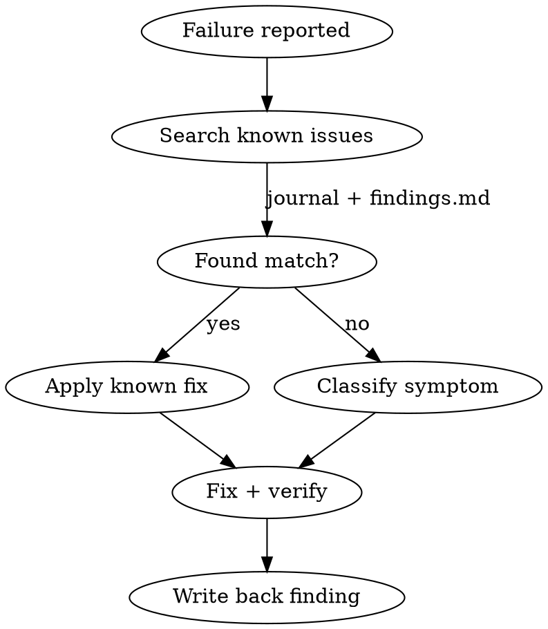

# E2E Skill Operations — Reference

Detailed checklists, symptom tables, and report templates for each mode. Loaded on demand from SKILL.md.

---

## Mode: --debug

Systematic diagnosis when an e2e skill execution fails.



### Symptom Classification

| Symptom | Category | Likely root cause | First check |
|---------|----------|-------------------|-------------|
| `strict mode violation` | MAPPING | Selector matches N>1 elements | Add `>> nth=0` or row context |
| `element not found` | MAPPING or FLOW | Selector stale or element renamed | Snapshot current page, compare a11y tree vs mapping |
| `auth expired / redirect to login` | ENVIRONMENT | Profile cookie expired | Delete `~/.agent-browser/<app>/`, re-auth |
| `@ref click wrong element` | SKILL | @ref reused across snapshots | Ensure snapshot immediately before every click |
| `is visible returns false` | SKILL | CSS-hidden element (Ant Design radio, checkbox) | Verify via snapshot a11y tree instead |
| `timeout / networkidle hang` | ENVIRONMENT | Dev server unresponsive or SPA infinite polling | Check `curl <base_url>`, check for websocket keepalive |
| `v1 flow format rejected` | FLOW | Legacy format (`app:` instead of `mapping:`) | Migrate: `app:`->`mapping:`, `name:`->`id:`, structured expects->grammar strings |
| `unresolved variable ${key}` | FLOW | Missing variable definition or typo | Check flow `variables:` block and mapping template params |
| `cross-site flow in Route A` | FLOW | Missing `--all-sites` or `--suite` flag | Use `--all-sites` or `--suite` for flows with `sites:` |

### Debug Checklist

1. **Capture evidence**: screenshot, snapshot a11y tree, console errors, step ID
2. **Search known issues**: `skill-quality-findings.md` for this symptom pattern
3. **Classify**: mapping / skill / flow / environment (see table above)
4. **Fix**: apply the smallest change that resolves the symptom
5. **Verify**: re-run the exact failing step (not full suite)
6. **Scan impact**: does this fix imply changes to other skills? (Impact Matrix)
7. **Write back**: new finding -> `skill-quality-findings.md` with severity + fix applied

---

## Mode: --maintain

After editing any e2e skill, ensure consistency across the ecosystem.

### Maintenance Checklist

1. **Describe the change** (1 sentence: what changed, which skill, which section)
2. **Search for prior art**: has this pattern been addressed before? (journal, findings)
3. **Impact scan** (full matrix in SKILL.md):
   - For each file: does it have equivalent logic that needs the same update?
   - Pay special attention to: auth flows (all 3 skills), common mistakes (all 3), selector conventions (record + test)
4. **List all proposed changes** with file path + section + rationale
5. **Order**: reference files first -> skill files -> mapping files
6. **Human approves** each change. If rejected: record the rationale in findings (why the change was proposed, why rejected) and move to next proposed change.
7. **Verify**: run a relevant flow to confirm no regression
8. **Record**: if the change stems from a finding, update `skill-quality-findings.md` status

### Common Sync Points

| If you change... | Also check... |
|------------------|---------------|
| Auth flow in any skill | All 3 skills' First-Run Auth + Re-Auth sections |
| Selector convention (e.g., `nth=0`) | Map Phase 3 format + Test Phase 2f validation + all mappings |
| Expect grammar pattern | Test Phase 2f table + walkthrough anomaly handling |
| Common mistake entry | All 3 skills' Common Mistakes tables |
| agent-browser command syntax | agent-browser `commands.md` + all 3 skills' action tables |

---

## Mode: --add-feature

Extend the e2e skill ecosystem with a new capability.

### Feature Development Checklist

1. **Feasibility PoC** — validate with real data before touching skills
   - Use actual `trace.zip`, mapping, or flow files from `e2e-reports/`
   - Document assumption vs reality gaps (see template below)
2. **Impact scan** — which skills and references need changes?
   - Primary: the skill that owns the feature
   - Secondary: skills that share related logic
   - Reference: agent-browser reference files if new commands/patterns used
3. **Design decision**: where does the feature live?
   - **Inline in skill**: simple, <20 lines, tightly coupled to execution flow
   - **Separate reference file**: complex, >50 lines, reusable across skills
   - **Script/template**: executable, parameterized, used by multiple skills
4. **Implement** — write changes to all affected files
5. **RED test** — dispatch subagent with a scenario that exercises the new feature, observe behavior
6. **Evaluate** — compare subagent output vs expected behavior
7. **Write back** — document the feature in `skill-quality-findings.md` under "New Features"

### Assumption-Reality Gap Log Template

When building a feature, track every gap between what you assumed and what you found:

```
| Assumption | Reality | Impact |
|------------|---------|--------|
| [what you expected] | [what actually happened] | [how it changed the approach] |
```

This log becomes part of the finding record and prevents future developers from hitting the same assumptions.

---

## Mode: --evaluate

Structured gap analysis after running e2e tests.

### Evaluation Checklist

1. **Collect results**: suite/flow output, pass/fail per step, error messages
2. **Search known issues**: for each failure, check `skill-quality-findings.md`
3. **Classify each failure** using the taxonomy below
4. **Identify skill gaps**: failures in SKILL category reveal instructions the agent couldn't follow
5. **Compare with prior findings**: which gaps are new vs recurring?
6. **Generate findings report** (see format below)
7. **Prioritize fixes**: P0 (blocks all testing) -> P1 (blocks specific flows) -> P2 (cosmetic)
8. **Propose skill improvements** for each SKILL-category gap
9. **Deep re-verification** (optional): for SKILL-category gaps, apply `VERIFICATION-SOP.md` checklists (frontmatter, behavior, edge cases) to the affected skill for comprehensive audit

### Failure Taxonomy

| Category | Meaning | Fix target |
|----------|---------|------------|
| MAPPING | Selector stale, element renamed/moved | `.claude/e2e/mappings/*.yaml` |
| FLOW | Step definition wrong, missing variable, v1 format | `.claude/e2e/flows/*.yaml` |
| SKILL | Agent misinterpreted skill instructions | `e2e-pipeline` plugin: `skills/e2e-*/SKILL.md` |
| ENVIRONMENT | Auth expired, seed data missing, server down | Dev setup, seed scripts |
| CASCADING | Failure caused by upstream dependency failure | Fix the upstream first |

### Findings Report Format

```markdown
# E2E Findings — [date] [project] [suite/flow name]

## Summary
| Metric | Value |
|--------|-------|
| Flows | N total, N pass, N fail, N skip |
| New findings | N (N critical, N medium, N low) |
| Known recurring | N |

## Failures
### [ID]. [Short title]
- **Category**: MAPPING / FLOW / SKILL / ENVIRONMENT / CASCADING
- **Step**: [step-id] in [flow-name]
- **Evidence**: [what happened]
- **Root cause**: [why]
- **Fix**: [what to change]
- **Skill gap?**: [if yes, what skill instruction was missing/unclear]

## Skill Improvements
| ID | Skill | Section | Change | Addresses |
|----|-------|---------|--------|-----------|
| S1 | e2e-test | Phase 2f | ... | F1 |

## Comparison with Prior Findings
[List recurring vs new vs resolved findings]
```
