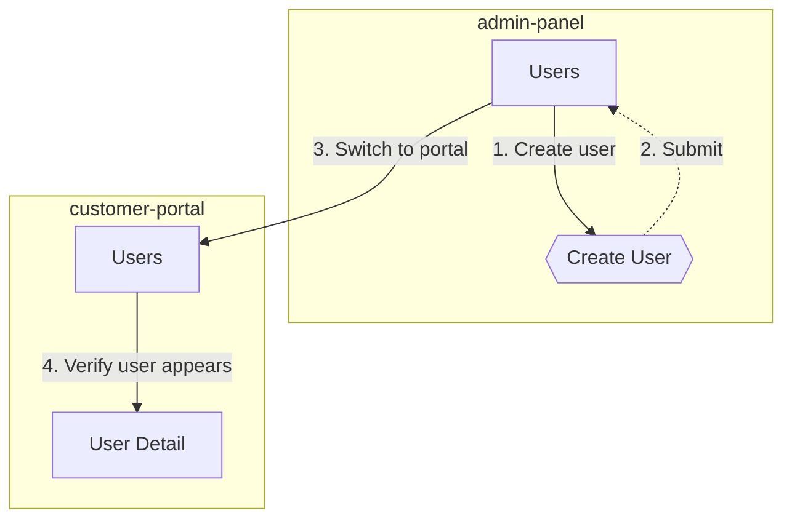

# E2E Walkthrough — Reference

Detailed execution mechanics and output procedures. Loaded on demand from SKILL.md.

---

## Phase 3 — Execution Details

### Browser State Check

Before opening a new browser session, check for stale sessions from previous skill invocations:

1. Check if agent-browser has an active session: `agent-browser get url 2>/dev/null`
   - If active and same `app` profile: navigate to `base_url` to reset page state
   - If active and different profile: close existing session first (`agent-browser close`)
   - If no active session: proceed normally with `open`
2. After opening/resetting, always verify auth before proceeding

### Startup

```bash
REPORT_DIR="$(pwd)/e2e-reports/$(date +%Y%m%d-%H%M%S)" && mkdir -p "$REPORT_DIR"
```

**Recording-aware browser open** (agent-browser v0.16.x `record` is incompatible with `--profile`):

- **Recording OFF** (`--no-video`): Use `--profile` as normal.
  ```bash
  agent-browser --profile ~/.agent-browser/<app> --headed open <base_url>
  ```
- **Recording ON** (default): Open WITHOUT `--profile`, then handle auth.
  ```bash
  agent-browser --headed open <base_url>
  ```

```bash
agent-browser wait --load networkidle
```

**Verify auth** (skip if `auth.type: none`):
```bash
agent-browser get url
```
Check URL against `auth.verification` condition. If verification fails (auth expired or no profile):

1. **Auto-login path** (preferred): If mapping has `auth.test_accounts` with email/password, use snapshot + fill to login automatically:
   ```bash
   agent-browser snapshot -i          # Find email/password fields
   agent-browser fill @<email> "<test_account_email>"
   agent-browser fill @<password> "<test_account_password>"
   agent-browser click @<submit>      # Login button
   agent-browser wait --load networkidle
   agent-browser get url              # Re-verify
   ```
2. **Manual path** (fallback): Read `auth.manual_prompt` from mapping and present to user. Browser is already `--headed` — user logs in directly. After user confirms → `agent-browser get url` and re-check. Repeat until verified or user aborts.

**Start recording** (if recording ON):
```bash
agent-browser record start "$REPORT_DIR/full.webm"
```

**Start trace** (after recording — trace captures internal data, recording captures visual viewport):
```bash
agent-browser trace start
```

### Multi-Site Startup (when `--sites` provided)

Open a session for each site:
```bash
# For each mapping in --sites:
agent-browser --session <app> --profile ~/.agent-browser/<app> --headed open <base_url>
agent-browser --session <app> wait --load networkidle
# Verify auth per site (same flow as single-site)
agent-browser --session <app> trace start
```

**Auth failure handling:** If a site's auth fails after 2 retry attempts, mark it SKIP. Report skipped sites before proceeding. Walkthrough continues on remaining sites.

### Site Switching During Walkthrough

When the plan transitions to a different site (or human requests it):
1. Current session stays alive (do NOT close)
2. Switch to target session: all subsequent `agent-browser` commands use `--session <target_app>`
3. Mapping context switches to the target site's mapping
4. Announce: "Switching to [portal] session..."

Human can request site switch anytime: "switch to admin", "go to portal", "check the other site".

### Per-Step Loop

1. `agent-browser snapshot` -> find element `@ref`
2. Execute action (click/fill via `@ref`)
3. `agent-browser wait --load networkidle`
4. `agent-browser screenshot "$REPORT_DIR/step-N.png"`
5. Health check (mode-dependent — see below)
6. Report to human (mode-dependent)

**Health check modes:**
- **Full walkthrough**: `agent-browser console --json` + `agent-browser errors --json` per step. Filter noise (defaults: HMR, favicon, React DevTools; app-specific noise may be defined in mapping under `health.known_noise`).
- **Smoke (`--smoke`)**: Skip per-step health checks — run `agent-browser errors --json` once at the end after all navigation steps. Smoke focus is selector verification, not runtime health.

**Selector verification strategy:**
- `text=` selectors: verify by comparing snapshot a11y tree text content against mapping values. Snapshot is the source of truth.
- `data-testid` / `aria-label` / `role=` selectors: **cannot** be verified via snapshot (a11y tree doesn't expose these attributes). Must use `agent-browser is visible "<selector>"` for DOM-level verification. In smoke mode, batch these into a post-walkthrough sweep (see `--smoke` rule 7).

### Interaction Modes

| | Guided (default) | Step | Auto |
|---|------------------|------|------|
| Before step | Show plan | Show + wait "go" | Silent |
| After step | Screenshot + summary | Screenshot + wait "go" | Continue |
| On anomaly | Pause, report | Pause, report | Log, continue |
| Human inserts | Anytime | Between steps | After done |

### Human Ad-Hoc Commands

- "click that button" -> agent uses latest snapshot
- "take a closer look at the table" -> snapshot + screenshot
- "go back" / "skip to step 6" / "stop here"

### Anomaly Handling

| Situation | Action | Track for Phase 4? |
|-----------|--------|---------------------|
| Unexpected dialog/toast | Screenshot, ask human | Yes — possible trigger mismatch |
| Element not found | Report mapping possibly stale | Yes — stale selector or missing element |
| Console error (real) | Guided/Step: pause; Auto: log | No |
| Step failure (required) | Present evidence (screenshot + console), offer: continue / debug / stop | Yes if mapping-related |
| Auth expired (per mapping verification) | Pause all modes. Present `auth.manual_prompt` from mapping. Browser is `--headed` — user re-logs in directly. `get url` to re-verify. Resume on success. | No |
| Page timeout | Retry once, then report | No |
| New element discovered | Note element name, selector, page | Yes — new element for mapping |

Maintain an in-memory list of mapping discrepancies throughout Phase 3. Each entry: `{type, page, element, details}`.

**Detection mechanisms:**
- **Stale selector**: `snapshot` a11y tree text differs from mapping's expected text for a `text=` selector, OR `is visible` returns `false` for a `data-testid`/`aria-label` selector
- **Missing element**: element listed in mapping is absent from both snapshot and `is visible` check
- **Trigger mismatch**: action on mapped element produces unexpected intermediate state (e.g., dropdown instead of direct dialog) — detected by post-action snapshot showing unexpected structure
- **New element**: element found in snapshot that has no entry in the current mapping page

**Debug pivot (on step failure):**
When human chooses "debug", keep browser open and switch to code investigation. After fix (hot reload), human says "re-run from step N" -> agent re-snapshots and continues from the failed step.

---

## Phase 4 — Output Details

### Stop Trace

```bash
agent-browser trace stop "$REPORT_DIR/trace.zip"
```

**Do NOT close the browser** — human may want to inspect the final state or continue exploring.

### Trace Analysis (Subagent)

Dispatch trace analysis to isolated context to keep verbose HAR data out of the walkthrough conversation.

| Field | Source | Required |
|-------|--------|----------|
| `trace_path` | `$REPORT_DIR/trace.zip` | YES |
| `report_dir` | `$REPORT_DIR` | YES |
| `noise_patterns` | mapping's `health.known_noise` list (if present) | NO |

```
Agent(subagent_type="e2e-trace-analyzer"):
  trace_path: "$REPORT_DIR/trace.zip"
  report_dir: "$REPORT_DIR"
  noise_patterns: <from mapping health.known_noise, or omit>
```

Agent returns: `analysis_path`, `api_failures`, `console_errors`, `clean` (true/false).

### Report

Write `$REPORT_DIR/report.md`: summary table, step results with screenshots, issues found, health log, artifacts. Include the trace-analysis.md content from the subagent.

### Flow Report (MANDATORY)

Write `$REPORT_DIR/flow-report.md`. This report visualizes the walkthrough as a mermaid flowchart with natural language descriptions, enabling developers and team members to understand and adjust the explored flow.

**File structure:**

````markdown
# Flow Report — <walkthrough context summary>

**Date**: YYYY-MM-DD HH:MM
**Mapping**: <mapping name>
**Mode**: guided|step|auto
**Result**: Explored N pages, N dialogs, N steps | N anomalies

---

## Overview

> <2-3 sentence summary>

## Flowchart


## Step-by-Step Narrative

### Step 1 — {source} → {target}
...

## Suggested Adjustments
<!-- omit section entirely when 0 anomalies -->
````

#### Mermaid Node Types

| UI concept | Syntax | Example |
|------------|--------|---------|
| Page | `["..."]` | `A["Dashboard"]` |
| Dialog/Modal | `{{"..."}}` | `C{{"Add Member Dialog"}}` |
| Form submit | `(["..."])` | `F(["Submit Form"])` |
| Conditional branch | `{"..."}` | `D{"Select Role"}` |

#### Edge Rules

- Label format: `"N. action summary"` (N = step number)
- Action summary: max 15 characters; truncate if longer
- Return to same page: dashed arrow `-.->` to distinguish "forward" from "back to origin"
- Same page appearing multiple times: reuse existing node (mermaid handles natively)

#### Node ID Rules

Use camelCase abbreviation of page name. Dialogs get `Dlg` suffix. Avoid mermaid reserved words.

#### Cross-Site Flowchart

Each site wrapped in `subgraph`, cross-site edges annotated with switch action:



#### Summary Generation

- 2-3 sentences: starting page, main path, conclusion
- Template: "Starting from `{start page}`, {path summary}. {conclusion}."
- Conclusion auto-select:
  - 0 anomalies: "All flows passed smoothly with no anomalies."
  - Has anomalies: "Found N anomalies — see Suggested Adjustments."
  - Has health issues: "Found N console errors / API failures — see trace analysis."

#### Step Narrative

- Title: `### Step N — {source page} → {target page/element}`
- Body: one paragraph — what action, where, what result
- Result tag: `PASS`, `CONDITIONAL` (RBAC), `FAIL`
- On FAIL: one-sentence reason summary (no screenshot paths — those belong in report.md)

#### Suggestions Section

| Source | Suggestion |
|--------|-----------|
| Stale selector | "Step N: `{element}` selector may be stale. Consider `/e2e-map --page {page}`." |
| Missing element | "Step N: expected `{element}` not found on `{page}`. Verify if removed or relocated." |
| Trigger mismatch | "Step N: `{element}` interaction behavior differs from mapping." |
| Console error | "Step N: console error — `{message first 80 chars}`" |
| API failure | "Step N: API failure — `{method} {path}` → `{status}`" |
| No anomalies | Omit the entire suggestions section |

#### report.md Integration

Add the following block at the top of `$REPORT_DIR/report.md` (before existing content):

```markdown
## Flow Report

> Explored N pages / N dialogs / N steps — N anomalies
> See [flow-report.md](./flow-report.md)

---
```

#### PR Posting (menu option 2)

When user selects "Post flow report to PR":

```bash
gh pr comment <PR> --body "$(cat $REPORT_DIR/flow-report.md)"
```

Mermaid renders natively in GitHub PR comments.

### Flow YAML Auto-Generation (MANDATORY)

**Always auto-generate a flow file after walkthrough completes.** Do NOT ask "Save as reusable flow?" — always write the file. This is mandatory because the proposal pattern gets skipped under context pressure, losing valuable walkthrough data.

**Auto-naming:**
```
walkthrough-<YYYYMMDD-HHMMSS>-<first-page>.yaml
```
- `<YYYYMMDD-HHMMSS>`: timestamp from `$REPORT_DIR` name (already in this format)
- `<first-page>`: the first page navigated to during the walkthrough, converted to kebab-case (replace `_` with `-`, strip characters outside `[a-z0-9-]`, truncate to 40 chars). E.g., `onboarding_get_started` → `onboarding-get-started`, `dashboard` → `dashboard`
- If the walkthrough starts with a verification (no navigation), use the page from the first action's `on <page>` reference
- Example: `walkthrough-20260308-143022-onboarding-get-started.yaml`

**Directory setup:** `mkdir -p .claude/e2e/flows/` before writing (directory may not exist on first walkthrough).

**Overlap detection (informational only):**
Before writing, scan `.claude/e2e/flows/*.yaml` for existing flows where 50%+ **of the new flow's** unique action target pages also appear in the existing flow. If overlap found:
```
Note: New flow overlaps with existing flow(s):
  - onboarding-full-flow.yaml (7/10 pages overlap)
You may want to consolidate or replace the older flow later.
```
This is informational — always write the new flow regardless.

**Serialization rules:**
- Use structured action references (`"Click <element> on <page>"`) not natural-language descriptions
- Set `mapping:` to the mapping filename without `.yaml` extension
- Format must match `/e2e-test` flow spec — valid keys: `name`, `description`, `tags`, `mapping` (single-site) or `sites` (cross-site), `variables`, `steps` (each with `id`, `site` (cross-site only), `action`, `expect`, `screenshot`, `optional`, `timeout`, `note`)
- Set `tags: [walkthrough, auto-generated]` plus any context-specific tags
- Set `description:` summarizing the walkthrough context

**Output path:** `.claude/e2e/flows/<auto-name>.yaml`

```
Flow saved: .claude/e2e/flows/walkthrough-20260308-143022-onboarding-get-started.yaml
  10 steps, tags: [walkthrough, auto-generated, onboarding]
  Replay: /e2e-test walkthrough-20260308-143022-onboarding-get-started
```

### Cross-Site Flow Generation

When a walkthrough used `--sites`, the auto-generated flow uses `sites:` instead of `mapping:`. The same mandatory auto-generation and auto-naming rules apply.

```yaml
# Auto-generated from cross-site walkthrough
name: <name>
description: "<description>"
tags: [cross-site]

sites:
  <alias1>: { mapping: <mapping1-filename-no-ext> }
  <alias2>: { mapping: <mapping2-filename-no-ext> }

steps:
  - id: <step-id>
    site: <alias>
    action: "<action string>"
    expect: [...]
```

Each step's `site:` is set based on which session was active during that walkthrough step.

### PR/Issue Posting

- `--pr`: `gh pr comment N --body-file pr-summary.md`
- `--issue`: Linear MCP `create_comment`

**PR Comment Template** (`--pr` mode):

```markdown
## E2E Walkthrough Verification Report

[1-2 sentence overview: what was verified and which scenarios were covered]

### Walkthrough A: [scenario name]

**Flow:** [one-sentence user journey description]

| Step | Screenshot | What happens |
|------|-----------|-------------|
| 1. [step name] |  | [what happened] |
| 2. [step name] |  | [what happened] |

<details>
<summary>Video recording (M:SS)</summary>

<!-- 👇 DRAG-DROP video.mp4 HERE (replace this line) -->
Video file: `$REPORT_DIR/walkthrough.mp4`

</details>

### Walkthrough B: [scenario name]

**Flow:** [one-sentence user journey description]

| Step | Screenshot | What happens |
|------|-----------|-------------|
| 1. [step name] |  | [what happened] |
| 2. [step name] |  | [what happened] |

---

### Summary

- [N] scenarios verified: [result summary]
- No console errors or network failures observed in traces
```

**Template rules:**

- **Step table is the core structure** — Every walkthrough and sub-scenario MUST have a full 3-column `Step | Screenshot | What happens` table. This lets reviewers see key frame changes at a glance. Never use a simplified 2-column table.
- **One section per scenario** — Each scenario gets its own `### Walkthrough [A/B/C/...]` section with a complete step table. Do not nest sub-scenarios within a parent section using different formats.
- **Intro paragraph** — Follow the `## E2E Walkthrough Verification Report` heading with a 1-2 sentence overview of what was verified.
- **Screenshot URLs**: Upload to PR branch, use `https://github.com/<org>/<repo>/blob/<branch>/<path>?raw=true`
- **Video**: MP4 cannot auto-embed — use `<details>` with drag-drop placeholder. One video block per walkthrough. If multiple scenarios share one recording, place the video block after the last related scenario.
- **Summary** — Always last. Bullet points summarizing results across all scenarios.

### Mapping Self-Repair

During the walkthrough, track every mapping discrepancy:
- **Stale selector**: element exists but selector doesn't match (text changed, role changed)
- **Missing element**: element removed or relocated to different page
- **Trigger mismatch**: interaction produces unexpected intermediate state
- **New element discovered**: element found during exploration that isn't in mapping

**Repair strategy by severity:**

| Discrepancies | Action |
|---------------|--------|
| 1-2 selector text changes | In-place patch: update selector/description in mapping. Human approves each change. |
| Structural change (trigger pattern, page reorganization) | In-place patch with `trigger_note` field documenting the new behavior. |
| 3+ stale selectors on same page | "Mapping for `<page>` appears significantly outdated. Recommend re-running `/e2e-map --page <page>` to refresh rather than patching individual selectors." |
| New elements discovered | Add to mapping under the correct page/dialog section. |

**`trigger_note` example:**
```yaml
project_settings:
  trigger_page: project
  trigger_element: project_settings_button
  trigger_note: "Two-step: button opens dropdown menu -> click menuitem 'Settings' to open dialog"
```

**Mapping file safety:** Before writing mapping changes, re-read the file to check for concurrent modifications (compare with the version loaded at skill start). If the file has changed since loading, present both versions and ask the user which to keep.

Always present the discrepancy list before making changes. Human approves -> agent updates mapping file.

### Browser Handoff (BLOCKING: flow YAML must be written first)

**Do NOT present this summary until Flow YAML Auto-Generation is complete.** Flow generation is lightweight (~20 lines YAML) and MUST finish even under context pressure.

Browser stays open after walkthrough. Present summary:

```
Walkthrough complete: 7/7 PASS
Browser still open at: <current URL>
-> Inspect manually, or say "close" when done
```

Only close after human confirms:
```bash
agent-browser close
```
